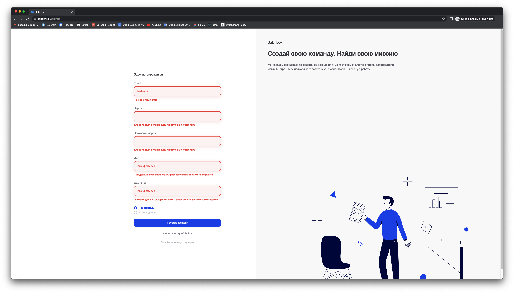
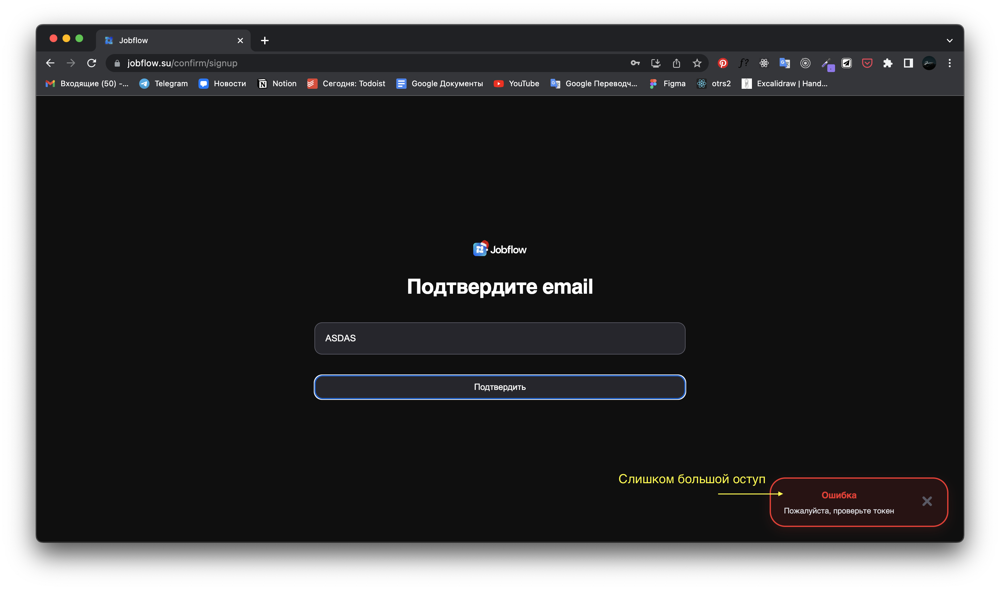
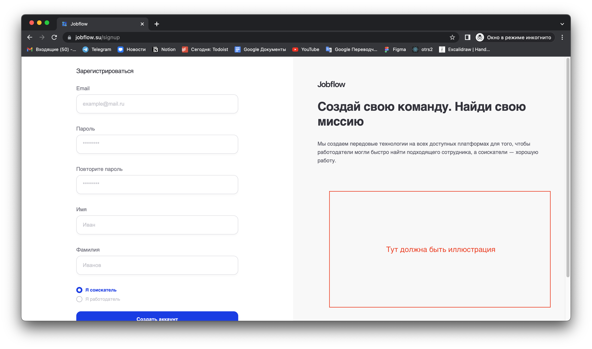
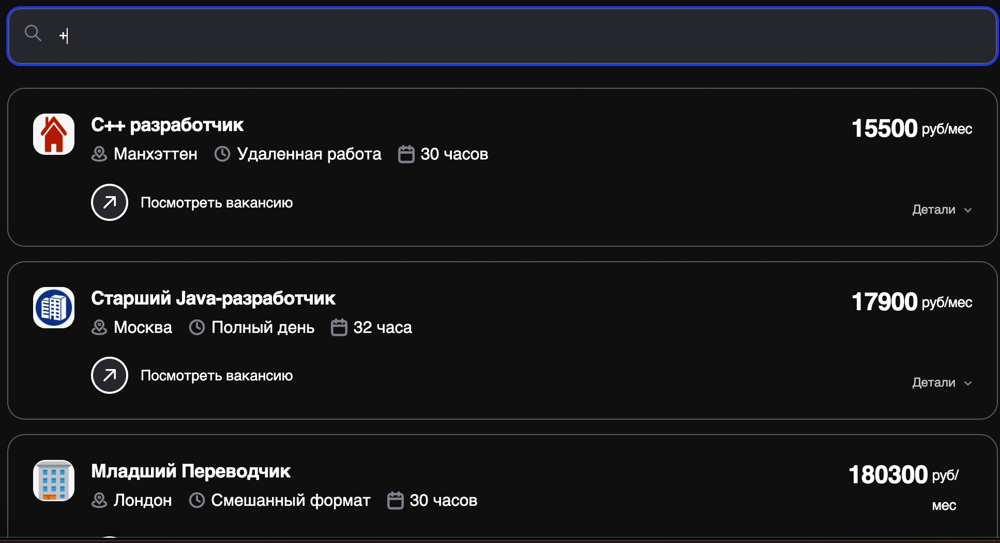
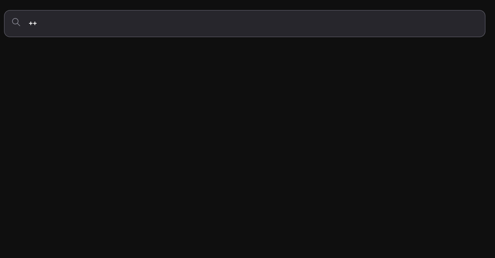

# 
Авторизация/Регистрация

## Ссылки на сайт:
<a href="https://jobflow.su/signin">Авторизация</a>

<a href="https://jobflow.su/signup">Регистрация</a>

## Тестирование
### Положительные сценарии
<b>Сценарии для экрана авторизации</b>
1. При наведении курсора на кноку "Войти" тип курсора меняется на pointer.
2. Под кнопкой "Войти" есть текст с поясненями, при нажатии на который пользователь переходит на экран регистрации.
3. После ввода валидных данных и нажатия на кнопку "Войти" пользователя редиректит на страницу его аккаунта.

<b>Сценарии для экрана регистрации</b>
1. При переключении на экране регистрации видов профиля("Я соискатель/Я работодатель") меняются поля вода. Для варианта "Я соискатель" появляются поля "Имя", "Фамилия". Для варианта "Я работадатель" появляется поле "Название компании".
2. При наведении курсора на кноку "Зарегистрироваться" тип курсора меняется на pointer.
3. Под кнопкой "Зарегистрироваться" есть текст с поясненями, при нажатии на который пользователь переходит на экран авторизации.
4. После ввода валидных данных и нажатия на кнопку "Войти" пользователя редиректит на страницу его аккаунта.

### Негативные сценарии
<b>Общие сценарии для экранов авторизации/регистрации</b>
1. При вводе невалидного email инпут подсвечивается красным и появлятеся сообщение об ошибке.
2. Если пароль не содержит буквы латиницы, цифры и спецсимволы(!#%^$), то поле пароль подсвечивается красным и появляется сообщение об ошибке. При нажатии на кнопку "Войти" ничего не происходит.
3. Длина пароля должна быть >= 8 и <= 20 символов. Если длина меньше, то поле пароль подсвечивается красным и появляется соответствующее сообщение об ошибке.
4. Если поля ввода пустые, появляется сообщение об ошибке.

<b>Сценарии для экрана авторизации</b>

1. Если пользователь пытается зайти с email, пользователь с которым не зарегистрирован в системе, появляется сообщение об ошибке.

<b>Сценарии для экрана регистрации</b>
1. Если пароли в полях "Пароль" и "Повторите пароль" не совпадают, появляется сообщение об ошибке - поле "Повторите пароль" подсвечивается красным, под ним выводится сообщение об ошибке.
2. Длина имени должна быть >= 1 и <= 20 символов. Если длина меньше, то поле "Имя" подсвечивается красным и появляется соответствующее сообщение об ошибке.
3. Длина фамилии должна быть >= 1 и <= 20 символов. Если длина меньше, то поле "Фамилия" подсвечивается красным и появляется соответствующее сообщение об ошибке.
4. Длина названия компании должна быть >= 1 и <= 20 символов. Если длина меньше, то поле "Название компании" подсвечивается красным и появляется соответствующее сообщение об ошибке.
5. Поля "Имя" и "Фамилия" должны содерждать только буквы русского или английского алфавитов. Если пользователь вводит какие-то другие символы должно появиться сообщение об ошибке.
6. Если пользователь пытается зарегистрироваться с email, который уже привязан к другому пользователю, появлятеся сообщение об ошибке.

Во всех случаях при возникновении ошибки кнопка "Войти" или "Зарегистрироваться" становится неактивной.

Пример правильного отображения ошибок:

# 
Экран подтверждения почты

Ссылка: https://jobflow.su/confirm/signup

### Положительный сценарий
При вводе корректного кода, пользователь автоматически переходит в свой аккаунт.

### Негативный сценарий
При вводе невалидного кода появляется сообщение об ошибке.

`BUG`

`BUG` - на некоторых разрешениях (например Macbook 13" не появляется иллюстрация)

# 
Поиск

## Ссылки:
<a href="https://jobflow.su/search/vacancy">Вакансии</a>

<a href="https://jobflow.su/search/resume">Резюме</a>

<a href="https://jobflow.su/search/applicant">Соискатели</a>

<a href="https://jobflow.su/search/employer">Работодатели</a>

## Тестирование

### Общие кейсы для поиска
1. При нажатии на Enter с пустым полем ввода результатом поиска будут все поля ✅
2. Поиск не чувствителен к регистру ✅
3. Поиск будет успешен, если запрос содержится как подстрока внутри названия сущности ✅
4. Поисковой запрос может содержать латинские буквы ✅
5. Поисковой запрос может содержать кириллицу ✅
6. Поисковой запрос может содержать спецсимволы (!"№;%:?*()_=+) ❌
	  При вводе спецсимволов поиск работает некорректно

#### Кейсы для поиска вакансий
1. Фильтры ✅
	1. Формат работы ✅
	2. Опыт работы ✅
	3. Зарплата ✅
	4. Город ✅
2. При нажатии на карточку/кнопку "Посмотреть вакансию" происходит переход на страницу вакансии ✅
3. При нажатии на "Детали" появляется дополнительная информация о вакансии ✅

#### Кейсы для поиска резюме
1. Фильтры ✅
	1. Опыт работы ✅
	2. Город ✅
2. При нажатии на карточку/кнопку "подробнее" происходит переход на страницу резюме ✅

#### Кейсы для поиска соискателей
1. Фильтры ✅
	1. Город ✅
2. При нажатии на карточку/кнопку "подробнее" происходит переход на страницу соискателя ✅

#### Кейсы для поиска работодателей
1. Фильтры ✅
	1. Город ✅
	2. Сфера деятельности ✅
2. При нажатии на карточку/кнопку "подробнее" происходит переход на страницу соискателя ✅
