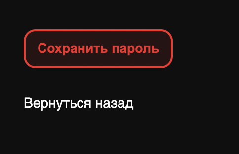

# 
Авторизация/Регистрация

## Ссылки на сайт:
<a href="https://jobflow.su/signin">Авторизация</a>

<a href="https://jobflow.su/signup">Регистрация</a>

## Тестирование
### Положительные сценарии
<b>Сценарии для экрана авторизации</b>
1. При наведении курсора на кноку "Войти" тип курсора меняется на pointer.
2. Под кнопкой "Войти" есть текст с поясненями, при нажатии на который пользователь переходит на экран регистрации.
3. После ввода валидных данных и нажатия на кнопку "Войти" пользователя редиректит на страницу его аккаунта.

<b>Сценарии для экрана регистрации</b>
1. При переключении на экране регистрации видов профиля("Я соискатель/Я работодатель") меняются поля вода. Для варианта "Я соискатель" появляются поля "Имя", "Фамилия". Для варианта "Я работадатель" появляется поле "Название компании".
2. При наведении курсора на кноку "Зарегистрироваться" тип курсора меняется на pointer.
3. Под кнопкой "Зарегистрироваться" есть текст с поясненями, при нажатии на который пользователь переходит на экран авторизации.
4. После ввода валидных данных и нажатия на кнопку "Войти" пользователя редиректит на страницу его аккаунта.

### Негативные сценарии
<b>Общие сценарии для экранов авторизации/регистрации</b>
1. При вводе невалидного email инпут подсвечивается красным и появлятеся сообщение об ошибке.
2. Если пароль не содержит буквы латиницы, цифры и спецсимволы(!#%^$), то поле пароль подсвечивается красным и появляется сообщение об ошибке. При нажатии на кнопку "Войти" ничего не происходит.
3. Длина пароля должна быть >= 8 и <= 20 символов. Если длина меньше, то поле пароль подсвечивается красным и появляется соответствующее сообщение об ошибке.
4. Если поля ввода пустые, появляется сообщение об ошибке.

<b>Сценарии для экрана авторизации</b>

1. Если пользователь пытается зайти с email, пользователь с которым не зарегистрирован в системе, появляется сообщение об ошибке.

<b>Сценарии для экрана регистрации</b>
1. Если пароли в полях "Пароль" и "Повторите пароль" не совпадают, появляется сообщение об ошибке - поле "Повторите пароль" подсвечивается красным, под ним выводится сообщение об ошибке.
2. Длина имени должна быть >= 1 и <= 20 символов. Если длина меньше, то поле "Имя" подсвечивается красным и появляется соответствующее сообщение об ошибке.
3. Длина фамилии должна быть >= 1 и <= 20 символов. Если длина меньше, то поле "Фамилия" подсвечивается красным и появляется соответствующее сообщение об ошибке.
4. Длина названия компании должна быть >= 1 и <= 20 символов. Если длина меньше, то поле "Название компании" подсвечивается красным и появляется соответствующее сообщение об ошибке.
5. Поля "Имя" и "Фамилия" должны содерждать только буквы русского или английского алфавитов. Если пользователь вводит какие-то другие символы должно появиться сообщение об ошибке.
6. Если пользователь пытается зарегистрироваться с email, который уже привязан к другому пользователю, появлятеся сообщение об ошибке.

Во всех случаях при возникновении ошибки кнопка "Войти" или "Зарегистрироваться" становится неактивной.

Пример правильного отображения ошибок:

# 
Экран подтверждения почты

Ссылка: https://jobflow.su/confirm/signup

### Положительный сценарий
При вводе корректного кода, пользователь автоматически переходит в свой аккаунт.

### Негативный сценарий
При вводе невалидного кода появляется сообщение об ошибке.

`BUG`

`BUG` - на некоторых разрешениях (например Macbook 13" не появляется иллюстрация)

# 
Поиск

## Ссылки:
<a href="https://jobflow.su/search/vacancy">Вакансии</a>

<a href="https://jobflow.su/search/resume">Резюме</a>

<a href="https://jobflow.su/search/applicant">Соискатели</a>

<a href="https://jobflow.su/search/employer">Работодатели</a>

## Тестирование

### Общие кейсы для поиска
1. При нажатии на Enter с пустым полем ввода результатом поиска будут все поля ✅
2. Поиск не чувствителен к регистру ✅
3. Поиск будет успешен, если запрос содержится как подстрока внутри названия сущности ✅
4. Поисковой запрос может содержать латинские буквы ✅
5. Поисковой запрос может содержать кириллицу ✅
6. Поисковой запрос может содержать спецсимволы (!"№;%:?*()_=+) ❌
	  При вводе спецсимволов поиск работает некорректно

#### Кейсы для поиска вакансий
1. Фильтры ✅
	1. Формат работы ✅
	2. Опыт работы ✅
	3. Зарплата ✅
	4. Город ✅
2. При нажатии на карточку/кнопку "Посмотреть вакансию" происходит переход на страницу вакансии ✅
3. При нажатии на "Детали" появляется дополнительная информация о вакансии ✅

#### Кейсы для поиска резюме
1. Фильтры ✅
	1. Опыт работы ✅
	2. Город ✅
2. При нажатии на карточку/кнопку "подробнее" происходит переход на страницу резюме ✅

#### Кейсы для поиска соискателей
1. Фильтры ✅
	1. Город ✅
2. При нажатии на карточку/кнопку "подробнее" происходит переход на страницу соискателя ✅

#### Кейсы для поиска работодателей
1. Фильтры ✅
	1. Город ✅
	2. Сфера деятельности ✅
2. При нажатии на карточку/кнопку "подробнее" происходит переход на страницу соискателя ✅

# 
Настройки

## Тестирование

### Общие кейсы для насторек
1. Каждое обязательное поле должно быть заполнено
2. Проверяется формат ввода номера телефона
3. Проверяется формат ввода почты
4. Проверяется формат ввода даты
5. При некорректном заполнении поля или отсутствии значения в обязательном поле выводится инофрмация о соответствующей ошибке
6. При загрузке нового аватара появляется его превью

#### Кейсы для настроек профиля соискателя
1. Возможность подключить двухфакторную авторизацию
2. Возможность подписаься на рассылку
3. Возможность выйти из аккаунта
4. Возможность вернуться назад без сохранения

#### Кейсы для настроек резюме
1. Возможность удалить резюме
2. Возможность вводить спецсимволы в название или описание (!"№;%:?*()_=+)
3. Возможность вернуться назад без сохранения

#### Кейсы для настроек профиля работодателя
1. Возможность выйти из аккаунта ❌

2. Возможность вводить спецсимволы в название или описание (!"№;%:?*()_=+)

3. Возможность вернуться назад без сохранения

### Кейсы для настроек вакансии
1. Возможность вводить спецсимволы в название или описание (!"№;%:?*()_=+)
2. Возможность вернуться назад без сохранения

# 
Страница вакансии

## Ссылка:
<a href="https://jobflow.su/vacancy/1">Вакансия</a>

## Тестирование

1. Нажатие на кнопку посмотреть вакансию происходит переход на страницу вакансии ✅
2. Нажатие на кнопку добавить в избранное вакансия добавляется в раздел избранные вакансии в профиле соискателя при этом текст на кнопке меняется на удалить из избранного ✅
3. Нажатие на кнопку отправить резюме открывается всплывающее окно со списком резюме соискателя, если резюме отсутствуют, то в сплывающем окне появляется кнопка создать резюме ✅
4. При нажатии на кнопку создать резюме выполняется переход на страницу создания резюме ✅
5. При нажатии на кнопку рядом с доступным резюме, резюме отправляется работодателю, появляется всплывающее окно - ваше резюме успешно отправлено ✅
6. Повторное нажатие на кнопку отправки резюме ❌
> **[БАГ]**
>
> Ожидаемый результат: При повторном нажатии на кнопку отправки, уже отправленного резюме, появляется всплывающее окно - вы уже отправили это резюме
>
> Фактический результат: При повторном нажатии на кнопку отправки, уже отправленного резюме всплывающее окно не появляется

# 
Страница соискателя

## Ссылка:
<a href="https://jobflow.su/applicant/10">Соискатель</a>

## Тестирование

1. Нажатие на кнопку подробнее на карточке соискателя происходит переход на страницу соискателя ✅
2. Нажатие на кнопку рядом с резюме соискателя происходит переход на страницу резюме ✅
3. Нажатие на кнопку с телефонной трубкой копируется телефонный номер соискателя ✅
4. Нажатие на кнопку с письмом копируется email соискателя ✅

# 
Страница работодателя

## Ссылка:
<a href="https://jobflow.su/employer/12">Работодатель</a>

## Тестирование

1. Нажатие на кнопку подробнее на карточке работодателя открывается страница работодателя ✅
2. Нажатие на кнопку посмотреть вакансию на карточке вакансии открывается страница вакансии ✅
3. Нажатие на кнопку с телефонной трубкой копируется телефонный номер работодателя ✅
4. Нажатие на кнопку с письмом копируется email работодателя ✅
5. Нажатие на кнопку хочу здесь работать происходит скрол страницы вниз к доступным вакансиям ✅

# 
Страница резюме

## Ссылка:
<a href="https://jobflow.su/resume/2">Резюме</a>

## Тестирование

1. Нажатие на кнопку подробнее на карточке резюме происходит переход на страницу резюме ✅
2. Нажатие на кнопку скачать резюме в pdf происходит скачивание резюме в формате pdf ✅

# 
Создание/редактирование резюме

## Ссылка:
<a href="https://jobflow.su/resume/new">Создание резюме</a>

## Тестирование

1. Тестирование поля для заголовка резюме ✅
    1. Длина названия резюме должна быть между 1 и 30 символами ✅
    2. Название резюме должно состоять из букв русского, английского алфавита или спец. символов ✅
2. Тестирование выпадающего списка для выбора опыта работы ✅
3. Тестирование поля для ввода описания резюме ✅
4. Нажатие на кнопку сохранить ✅
    1. Если все поля заполнены, резюме сохраняется в бд и отображается на странице профиля пользователя ✅
    2. Если одно из полей не заполнено, появляется всплывающее окно заполните это поле ✅
5. Нажатие на кнопку удалить происходит удаление резюме пользователя из бд, резюме перестает отображаться на странице профиля пользователя ✅

# 
Создание/редактирование вакансии

## Ссылка:
<a href="https://jobflow.su/vacancy/new">Создание вакансии</a>

## Тестирование

1. Тестирование поля название вакансии
    1. Длина названия резюме должна быть между 1 и 30 символами ✅
    2. Название резюме должно состоять из букв русского, английского алфавита или спец. символов ✅
2. Тестирование поля ввода зароботной платы ✅
    1. Длина числа зарплаты не может быть больше 10 цифр ✅
    2. Возможен ввод только чисел ✅
3. Тестирование выпадающего списка для выбора опыта работы ✅
4. Тестирование поля ввода города работы ❌
    1. Название города должно начинаться с большой буквы и содержать максимум 3 пробела ✅
    2. Валидация на количество символов ❌
    > **[БАГ]**
    >
    > Ожидаемый результат: Валидация на ввод очень большого слова
    >
    > Фактический результат: Валидация отсутствует
5. Тестирование поля ввода графика работы ✅
6. Тестирование выпадающего списка для выбора формата работы ✅
7. Тестирование полей ввода описания вакансии ✅
8. Нажатие на кнопку сохранить ✅
    1. Если все поля заполнены, вакансия сохраняется в бд и отображается на странице работодателя ✅
    2. Если одно из полей не заполнено, появляется всплывающее окно заполните это поле ✅
9. Нажатие на кнопку назад переход на страницу работодателя ✅
